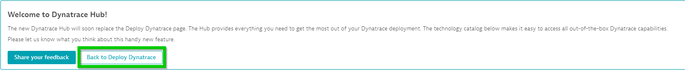
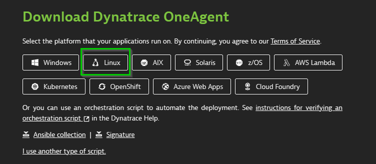
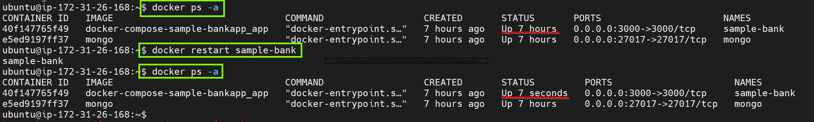
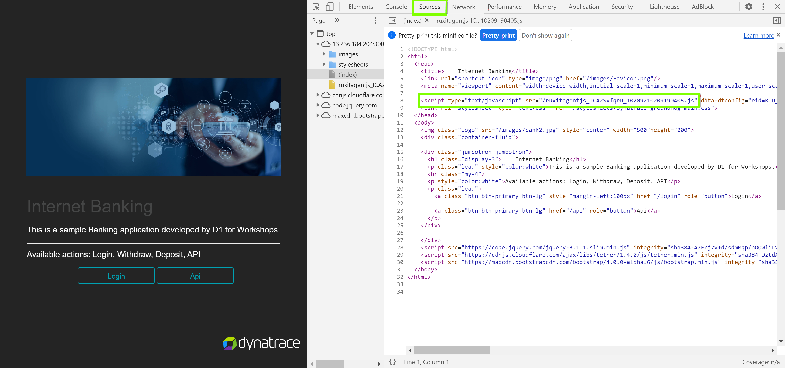

summary: Introduction to RUM
id: RUM-Session1
categories: scrum-intro
environments: steplabs
status: Published
author: Abhinandan Anantha
feedback link: mailto:d1-apac@dynatrace.com
analytics account:
<!-- ------------------------ -->
# Real User Monitoring - Session 1
<!-- ------------------------ -->
## Prerequisites

In this excerise, we will deploy the sample-bank web application

### Deploy the Application using Docker-Compose

* Navigate to the `docker-compose-sample-bankApp` folder  


* Run the following code to deploy your application: `sudo docker-compose up`  


### Accessing the Application UI

To do so navigate to Host View, dropdown the **Properties and Tags** and you will get a list of various metadata associated with the host created. Locate the **Public IP Address** and copy its value.


Open up your **web browser** and access the sample application with `<IP ADDRESS>:3000`


<!-- ------------------------ -->
## OneAgent Installation 

In this exercise, we will deploy the OneAgent to a Linux instance and let the OneAgent discover what is running in that instance.

### Download OneAgent

Negative
: Use PuTTy (Windows), PowerShell (Windows) or Terminal (Mac), ssh into the instance (IP address using the your PEM Key)

1. Open your browser and access the Dynatrace URL.

1. Select **Deploy Dynatrace** from the navigation menu.  


1. It opens up **Dynatrace Hub** and from there, we will need to select "Back to Deploy Dynatrace".  


1. Click the **Start installation** button and select **Linux**.  
  


1. Choose the installer type from the drop-down list (we'll use the default x86/64). Use the Linux shell script installer on any Linux system that's supported by Dynatrace, regardless of the packaging system your distribution depends on.

1. **Copy** the command provided in the "Use this command on the target host" text field. **Paste** the command into your terminal window and execute it.  


Positive
: Example:  


### Execute the installation script

(Optional) Once the download is complete, you can verify the signature by copying the command from the *"Verify signature"* text field, then pasting the command into your terminal window and executing it. Make sure your system is up to date, especially SSL and related certificate libraries.

**Copy** the command that's provided in the text box "And run the installer with root rights" text field.


Paste the command into your terminal window and execute it. You will need to make the script executable before you can run it.

Note that you will need root access. You can use sudo to run the installation script. To do this, type the following command into the directory where you downloaded the installation script.

Positive
: Example:  


<!-- ------------------------ -->
## OneAgnet Application injection

In this exercise, we will check the OneAgent injection into the application and verify the injection of the JavaScript in the application UI.

### How to check application is monitored by OneAgent?

To confirm that the application's web front-end process is monitored, go to the application UI and check if the RUM JavaScript tag has been correctly injected into the application's HTML

Navigate to the application UI and open the browser's DevTools to check the **Sources** and cleck the `<HEAD>` element to locating the JavaScript. Search the script that contains the string `ruxitagentjs` in its file name.


### Exploring Dynatrace

Login to the Dynatrace environment and explore around **Smartscape, Host View.**

To make sure that the application requests are captured by Dynatrace, go to **Host > ec2-instance > bin/www (node-bank2)** which is the Application Process.

You will discover that Dynatrace automatically monitors the host metrics, processes but not the **services**


### Restarting Sample-Bank container

For Dynatrace to get Services (code-level visibility), the Application services need to be restarted. Since the application is containerized, the easiest way to do that is to restart the docker containers.

To list all the docker containers, run `$docker ps -a`

Run the following command to restart `$docker restart sample-bank` to restart the Sample Banking Application

To check and verify that Sample Bank Application container has been restarted, run `$docker ps -a` again



### Confirming OneAgent injection

If the applications or Real User Monitoring data is not seen in Dynatrace, the first thing which is needed to do is confirm that there is traffic in the web front-end processes (web server, Java, Node.js, etc). To do this, interact with the applications' pages to generate some traffic.

Access the banking App with the either of the below credentials

Username: guestuser1@mybank.com 
Password: GuestUser12@

OR

Username: guestuser2@mybank.com 
Password: GuestUser12@

Once contain that the web front-end processes have traffic on them, check the following to determine the RUM JavaScript Tag injection from Dynatrace

<!-- ------------------------ -->
## Troubleshooting

In this excerise, we will verify if the OneAgent is monitoring the application.

### Confirming that the RUM JavaScript tag has been correctly injected into the application's HTML

Check for the Dynatrace JavaScript if the application contains the string `ruxitagentjs` in the **Source** files under the `<HEAD>` element

```bash
<!-- Example - Auto injection of JavaScript tag -->
<script type="text/javascript" src="/ruxitagentjs_[...]_[...].js" data-dtconfig="[...]"></script>
```  


### Confirming that the RUM JavaScript tag has downloaded correctly

With the help of browser DevTool, load the application's page and navigate to **Network** section. Confirm if the response of the JavaScript code exists with a response status `200 "OK"`


### Confirming that RUM monitoring data is been sent to Dynatrace

The JavaScript Tag reports back data via XHR or CORS post requests. The requests can be viewed among the **Network** operations using the browser DevTools. The URL related to the request will begin with `rb_` and must have status `200 "OK"` response and must start with `**OK**`


### Verify real user identifer is equal to cookie value

Create a new user session and then navigate to your tenant and find the real user identifier.


Navigate back to to the sample bank application and in chrome dev tools to find the cookie value and verify it matches with the real user identifier. 

 

<!-- ------------------------ -->
## Defining the Application

In this excerise, we will define the Application detection rule to route the traffic. 

As a starting point, all monitoring data is encapsulated in a placeholder application called `My Web Application`. The reason being that this placeholder applicaiton is to allow for more flexibility, as it would be easier on how the applications should be organized.

### Application detection rule

Application detection rule would falicated to create more applications, change existing application mapping, or if needed define more complex rules looking at URL's and not only on domains.

From the navigation menu, select **Settings > Web and mobile monitoring > Applications detection**. Under the **Define application detection rule** section, the list of defined rules are available in the sequential order and the top of list takes the priority over the following rules.

Select **Add detection rule** and select the rule applies to `New application` and provide a custom name for the application under the name text field. 

Define which web requests are part of this application by selecting the condition as `If the URL` and scope to be `contains` with the `<IP ADDRESS>:3000`


<!-- ------------------------ -->
## RUM User Session Details

In this excerise, we will be highlighting "User Sessions" and different user actions captured in the user-session. We will also be looking into the waterfall model to view application load times.

1. Navigate to User sessions from the burger menu on the left. There will be no user sessions  


1. Create a user session by navigating through the sample-bank application in an incognito window and then close the broweser window when complete.  


1. Navigate back to the Dynatrace tenant and view the the user action  


1. Navigate to session details for further drill-down  


### Waterfall Analysis 

Dynatrace captures user experience and performance data by monitoring individual user actions. Typically a user action begins with a click on an HTML control (for example, a button or link). The browser then loads the requested data, either by navigating to a new page or via an XHR/fetch call. JavaScript callbacks are then executed, the DOM tree is built or changed, and the web application is then once again ready for a new user action. 

Select a user action and perform a waterfall analysis


### Key User Actions

With the key user action feature, you can customize the Apdex thresholds for each of these user actions. You can use this feature to monitor key actions with a dedicated dashboard tile and track historic trends.

1. Navigate to the applications page and the select the application
2. Click view full details under the Top 3 user actions
3. Under Top 100 user actions, select a user action.
4. On the top-right corner of the User action details page, select Mark as key user action. The selected user action will now be displayed under Key user actions on the User action analysis page.


<!-- ------------------------ -->
## User Session-Property & User Tag

In this exercise, we will need to define the Request attribute to track specific request. 

### Define Request Attribute

1. Select "Settings" from the navigation menu
1. Click on "Server-side service monitoring" 
1. select "Request attributes"
1. Click on Select "Define a new request attribute"
1. Provide "Request attribute name" as **Amount**, will leave rest of the settings as default.
1. Click on "Add new data source"  


1. Click on "Request attribute source" dropdown, select **HTTP POST parameter** and provide a "Parameter name" as **amount**, and click on "Save".
1. After defining the Request attribute, click on "Save".  


### Define session property
1. Select "Application" fro the navigation menu and select "BankApp" application
1. Click on "..." and select "Edit"
1. Click on "Capturing" and select "Session and action properties"
1. Select "Add property"
1. Select **Server side request attribute** from "Expression type", select **Amount** from Request attribute name, provide "Display name" as **Amount entered**, and enable "Store as session property" and click on "Save property"  


After setting it up, we can generate user sessions and to review it, we will need to navigate to "User Sessions" and select the generated session, under the session we can see our defined user session property as highlighted,   


### Define user tag
1. Navigate to Sample BankApp's settings page
1. Select "Capturing" and click on "User tag"
1. Select "Add tag(identifier) rule"
1. Select "CSS selector" and define it as  **body>div:nth-child(1) > p**, enable "Apply cleanup rule" and define the regex as **\welcome(.*+)** and Click on "Save changes"  


1. Select "User Sessions" from navigation and we can see our generated session with the user tag, we can click on the user session and can see the user tag  


<!-- ------------------------ -->
## Conversion Goal

In this excerise, we will define Conversion goal and monitor the user session which has met the goal defined.

### Creating Conversion Goal

To define a conversion goal, navigate to the application settings by clicking on **Browse [...] > Edit**. Select **Session Replay and behaviour > Conversion goals** and click **Add goal** to set up the goal.

1. Start with defining the **Name** of the goal 
1. Select respective **Type of goal** as `User Action` 
1. followed by **Rule applies to:** to be `Load actions` 
1. Define the **Rule:** to be `Action name > contains > /member/withdraw`
1. Click on the **Save** to save the defined conversion goal.  


### Measuring Conversion Goal

1. Navigating to the **User session**.
1. Use the filter option to sort the user session which met the conversion goal defined by selecting **Conversion Goal** 
1. Selecting the **Goal**. 
1. Selecting the sepecific user session and navigating to the user actions, the defined user action will be easy to identy goal by searching the [🏁] symbol.  


<!-- ------------------------ -->
## Session Replay

In this excerise, we will configure Session replay and check the session replay which captured the user session.

### Enable session replay

1. To enable Session Replay navigate to the **Applications** menu
1. Select the application which needs to be configured. 
1. Select the **Browse [...]** button **> Edit**. 
1. From the application settings menu, select **Session Replay and behaviour > Session Replay** and turn on **Enable Session Replay** togel.


### Masking Session Replay

Session Replay implements masking functionality that ensures that private user information is either not captured at the time of recording and/or masked at the time of session playback.

This option allows a more customized aproach to configure masking. The changes in the configuartion can be made to suite the session-recording requirements which does not require any changes in the application code. The functionality is used to hide interactions with specific elements that might inadvertently reveal confidential end-user information. 


### Sample Session Replay

<!--  -->